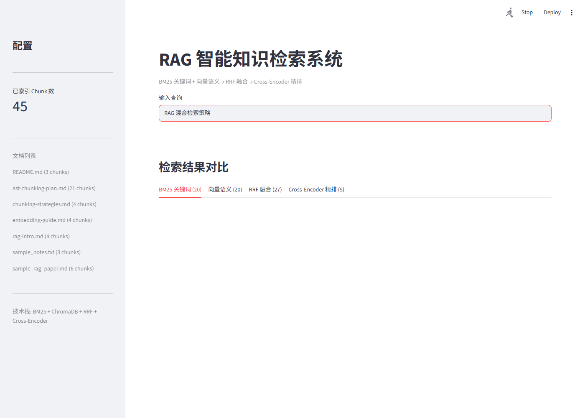
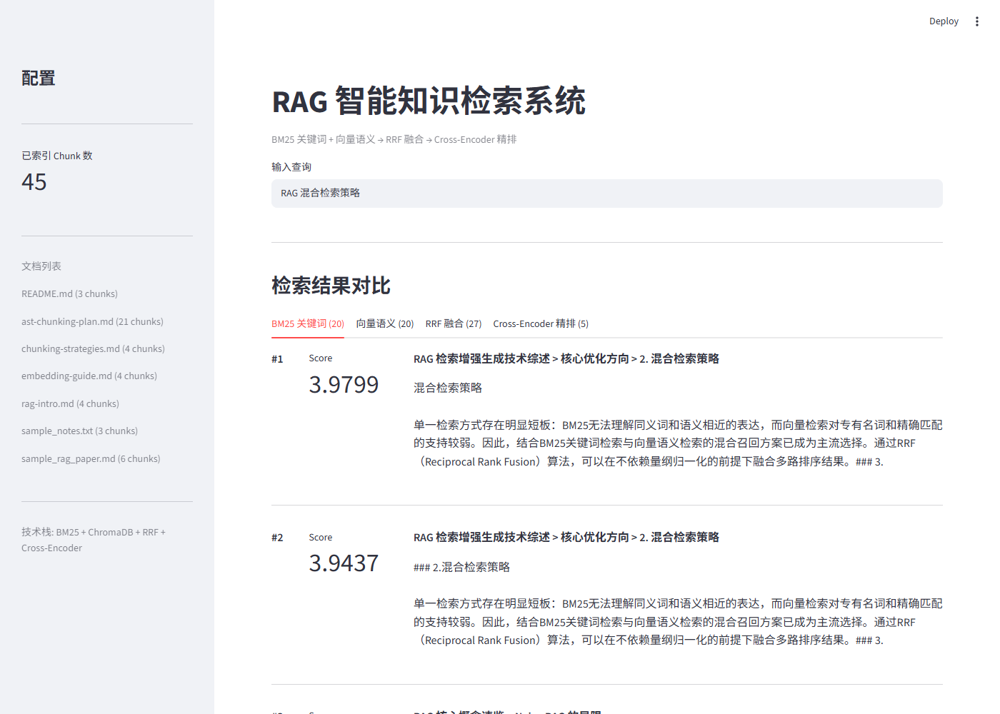
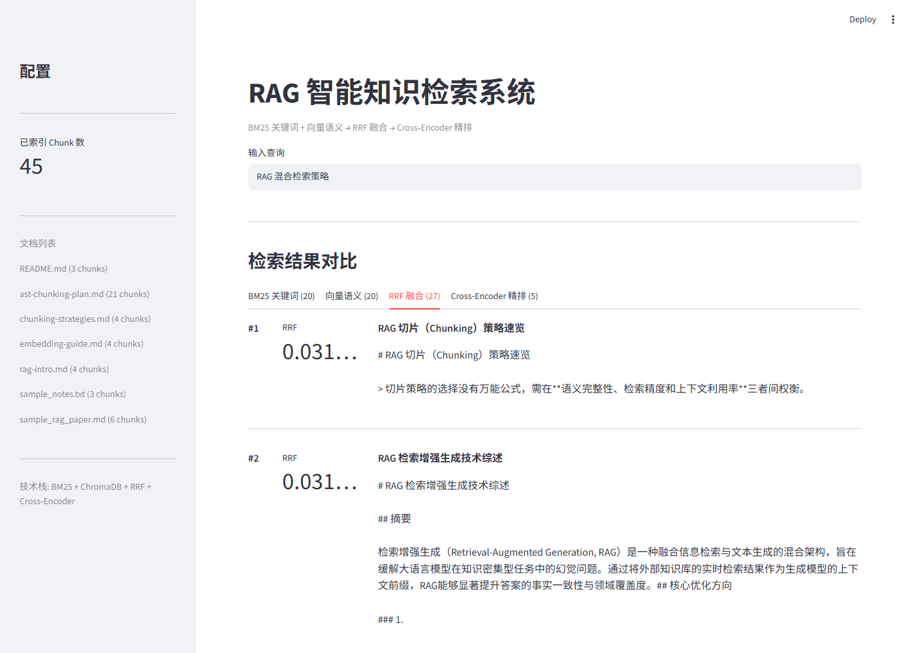
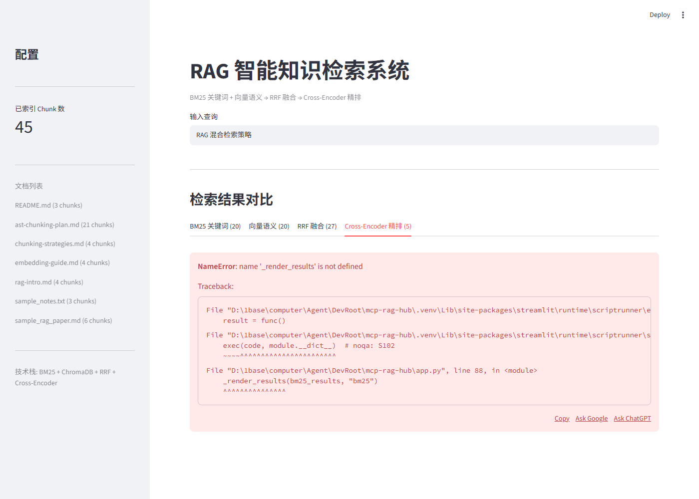

# MCP-RAG-Hub

一个可本地运行的 RAG 知识库 MCP 服务：把文档喂给它，Claude 等 AI 客户端就能通过标准接口检索你的本地 PDF / Markdown / TXT / Python 文档。

<div align="center">
  
  <br/>
  <em>输入一条查询，界面同时展示关键词、语义、融合、精排四个阶段的检索结果</em>
</div>

全手工实现（非调现成 RAG 框架）的端到端管线：文档解析 → BM25+向量混合召回 → RRF 融合 → Cross-Encoder 精排 → LangGraph 代理编排 → FastMCP 工具封装，配 36 条 Golden Test Set 完整评测。

**[项目详解](docs_knowledge/项目详解.md)** · **[技术视角详解](docs_knowledge/技术视角详解.md)** · **[章节笔记](docs_knowledge/chapters/)** · **[界面截图](screenshots/)**

## 功能

- **全手工 RAG 管线** — 文档解析（PDF/Markdown/TXT/Python，按类型分块）→ BM25+向量双路召回 → RRF 融合 → Cross-Encoder 精排，全链路自研，不依赖现成 RAG 框架
- **Streamlit 交互** — 四标签页逐阶段展示 BM25/向量/RRF/CE 检索结果，输入一条查询即可看到每路召回与最终排序
- **LangGraph 代理** — 五节点状态机，条件路由，查询改写与自我纠错
- **MCP 工具** — FastMCP 封装四个工具接口，可接入 Claude Desktop 等任何 MCP 客户端
- **完整评测** — 36 条 Golden Test Set，MRR/Hit@K/Precision@K/Recall@K + 自实现 LLM-as-Judge + 消融实验
- **知识图谱检索**（可选实验功能，默认关闭）— LLM 三元组抽取 + 有向图构建，用 `ENABLE_KG` 开关启用

**四阶段检索界面实拍**（输入查询后四个标签页各自展示该阶段的检索结果）：

| BM25 关键词召回 | 向量语义召回 |
|:---:|:---:|
|  |  |
| **RRF 融合** | **Cross-Encoder 精排** |
|  |  |

## 快速开始

**前提**：Python 3.11+。知识库文件放在 `docs/` 目录（内置少量示例文档），首次运行会自动解析并构建索引。

```bash
# 1. 创建虚拟环境（Windows）
python -m venv .venv
.venv\Scripts\activate

# 2. 安装依赖
pip install -r requirements.txt

# 3. Windows 下额外安装 PyTorch（CPU 版即可，requirements.txt 不自动带）
pip install torch --index-url https://download.pytorch.org/whl/cpu

# 4. 启动 Streamlit 网页界面，浏览器打开 http://localhost:8501
streamlit run app.py
```

> 也可跳过界面，直接作为 MCP 服务使用（见下文）。Embedding 模型首次运行会自动下载到本地缓存，之后可设 `HF_HUB_OFFLINE=1` 离线启动。
>
> 纯检索演示无需 Ollama；仅 **LangGraph 代理 / LLM 评测（LLM-as-Judge）** 需要本机安装 Ollama 并拉取 `qwen2.5:7b`。

## 接入 MCP 客户端（Claude Desktop / Cursor 等）

把本服务作为知识库工具接入任何 MCP 客户端。以 Claude Desktop 为例，在 `claude_desktop_config.json` 中加：

```json
{
  "mcpServers": {
    "rag-knowledge": {
      "command": "python",
      "args": ["D:/path/to/mcp-rag-hub/src/mcp_server.py"]
    }
  }
}
```

启动后暴露四个工具：

| 工具 | 用途 |
|------|------|
| `search_knowledge` | 混合检索（BM25+向量→RRF→CE）并返回精排结果 |
| `list_documents` | 查看当前知识库已索引的文档 |
| `get_chunk` | 按编号获取指定切片的完整内容 |
| `get_chunk_count` | 查看知识库切片总数 |

## 项目结构

<details>
<summary>点开看完整目录树（含各模块职责）</summary>

```
mcp-rag-hub/
├── app.py                     # Streamlit 前端入口
├── agent.py                   # LangGraph Agent 入口
├── config.py                  # 全局配置中心
├── requirements.txt
│
├── src/
│   ├── models.py              # Chunk / RetrievalResult 数据结构
│   ├── data_pipeline.py       # 文档加载 + 按文件类型路由分块（Markdown 标题滑窗 / Python AST / 通用滑窗）
│   ├── retrievers.py          # BM25 + 向量双路召回
│   ├── graph_retriever.py     # 实体共现图检索（可选实验功能）
│   ├── kg_retriever.py        # LLM 三元组知识图谱检索（可选实验功能）
│   ├── kg_builder.py          # DeepSeek LLM 抽取三元组、构建知识图谱缓存
│   ├── fusion.py              # RRF 融合 + Cross-Encoder 重排序
│   ├── mcp_server.py          # FastMCP 工具封装
│   └── evaluation/            # 评测子包
│       ├── metrics.py         # 共享评测指标
│       ├── retrieval_eval.py  # 检索质量评测
│       ├── llm_eval.py        # LLM-as-Judge 生成评测
│       ├── agent_eval.py      # Agent 改写评测
│       └── experiments.py     # 消融实验与数据分析
│
├── data/
│   ├── test_queries_all.json  # 全部 36 条（E01-E08, S01-S08, M01-M08, G01-G12）
│   ├── train_queries.json     # 训练集 18 条（按类别难度平衡分配）
│   └── test_queries.json      # 测试集 18 条（与 train 互补，不参与调参）
│
├── docs/                      # 知识库数据源
├── journal/                   # 踩坑日志与学习笔记
├── docs_knowledge/            # 项目文档与章节笔记
├── experiments/               # 实验结果 JSON
└── chroma_db/                 # ChromaDB 持久化向量库
```

</details>

## 关键数据

> 基于 36 条四类分层 Golden Test Set（exact_match / semantic / mixed / graph），train/test 严格分离，test 集不参与调参。
> 以下为 2026-08-04 清理知识库（过程笔记迁出 docs/）并重写测试集后的**最终基线**，实验过程详见 [KG 消融实验笔记](journal/2026-08-04-kg-ablation-notes.md)。

### Test 集（18 条）各阶段指标

| 阶段 | MRR@5 | Hit@5 | Prec@5 | Recall@5 |
|------|-------|-------|--------|----------|
| BM25 | **0.8704** | 0.9444 | 0.4667 | 0.8611 |
| Vector | 0.7384 | 0.9444 | 0.4889 | 0.8981 |
| RRF 融合 | 0.8565 | **1.0000** | 0.4889 | **0.9722** |
| CE 精排（全管线） | 0.7546 | 0.9444 | **0.5556** | 0.8796 |

**怎么读这张表：**

- **RRF 融合阶段 Hit@5 = 100%**：召回侧能力充足，正确文档几乎必然进入候选集，后续只需排序
- **CE 精排把 Precision@5 从 0.49 提升到 0.56**：精排的价值在于把最相关的文档顶到最前；MRR 略低于 RRF 系个别 case 被重排出 Top-5 所致，属已知权衡而非普遍问题
- **延迟剖析（本地 CPU）**：全链路均值 395ms，其中 CE 精排 373ms 占 94%——这正是采用两阶段架构、将精排限制在 Top-20 候选内的原因（详见 `experiments/latency_profile.json`）

**知识图谱的价值定位：** 作为可选实验功能（`ENABLE_KG` 开关），展示 LLM 三元组抽取 + 有向知识图谱构建 + 多路融合设计。通过对照实验发现：在小规模同主题语料上，KG 路因实体区分度不足而不提升指标（清理噪声文档后 KG Hit@5 从 33% 升至 100%，但 MRR 天花板仍低），故默认关闭——这是数据驱动的架构决策，不是妥协。完整归因过程见 [KG 消融实验笔记](journal/2026-08-04-kg-ablation-notes.md)。

## 技术栈

| 层次 | 技术 |
|------|------|
| 语言 | Python 3.11+ |
| Embedding | sentence-transformers/all-MiniLM-L6-v2（384 维） |
| Cross-Encoder | cross-encoder/ms-marco-MiniLM-L-6-v2 |
| 向量库 | ChromaDB（HNSW 索引, cosine 距离） |
| 关键词检索 | rank-bm25 + jieba 分词 |
| 图检索 | NetworkX 实体共现图 + 子图遍历 |
| 融合 | RRF（Reciprocal Rank Fusion, k=60） |
| 代理 | LangGraph（声明式状态机, 条件路由） |
| LLM | Ollama + qwen2.5:7b |
| 评测 | 自实现 LLM-as-Judge（Faithfulness / Answer Relevancy / Context Recall，Ollama qwen2.5:7b 评分） |
| MCP | FastMCP 2.0（stdio 传输） |
| UI | Streamlit |
